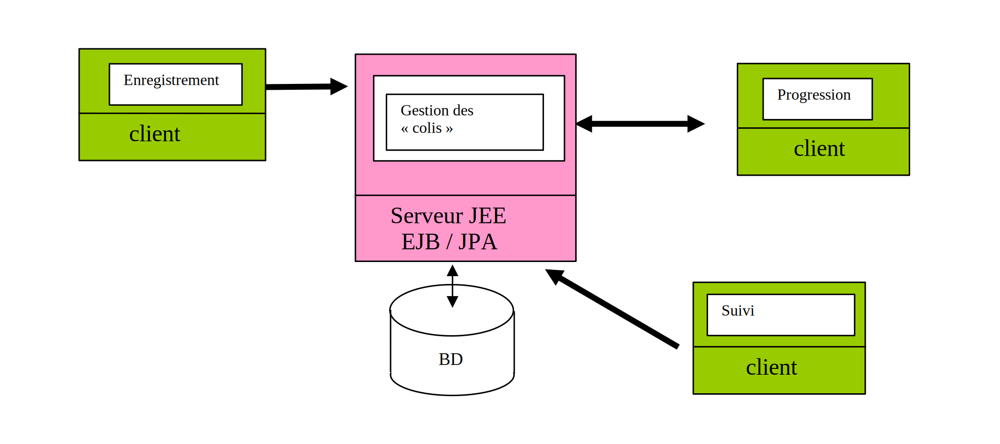

# 
I706 – TP JEE (JavaEE/JakartaEE)

Ce projet consiste à implanter une application pour gérer les « colis » acheminés par une importante société spécialisée dans le transport.

Chaque « colis » devant être acheminé sera caractérisé par : 

* un identifiant unique,
* son poids,
* sa valeur,
* son origine,
* sa destination.

En outre les « colis » seront suivis lors de leur acheminement. À cet effet la position de chaque « colis » sera entrée régulièrement dans le système, ce qui permettra de suivre sa progression. À chacune de ces étapes, on pourra modifier la position du « colis » et son état :

* latitude, 
* longitude,
* emplacement (chaîne de caractères, par ex : entrepôt xxx, douane yyy,  etc...),
* état (enregistrement, en attente, en acheminement, bloqué, livré,...).

Un serveur d'application JEE gérera de façon centralisée les données liées à la gestion des « colis ». 

Les colis seront représentés à l'aide d'entités JPA ce qui permettra de les stocker dans la base de données. Un ou plusieurs EJB sessions serviront de façade aux clients pour manipuler les colis.

On aura trois clients (sous la forme, par exemple, de 3 pages web) pour accéder à l’application : 

* le premier servira à réaliser l’enregistrement initial d’un « colis » ;
* le second permettra de changer les coordonnées  du colis à chaque étape ;
* le dernier permettra au client de suivre la progression du colis.

## Rendus :
Le rendu du TP se fera sous la forme d'un dépot git (votre enseignant _Stéphane Talbot_ est connu sous pseudo _stalb_ sur github/gitlab/bitbucket). 

Il y aura un rendu partiel, à la fin de chaque seance de TP, et un rendu final.  
Outre les sources du TP le rendu final comportera un compte-rendu expliquant : 

* les choix d'implantation, 
* comment utiliser l'application.
